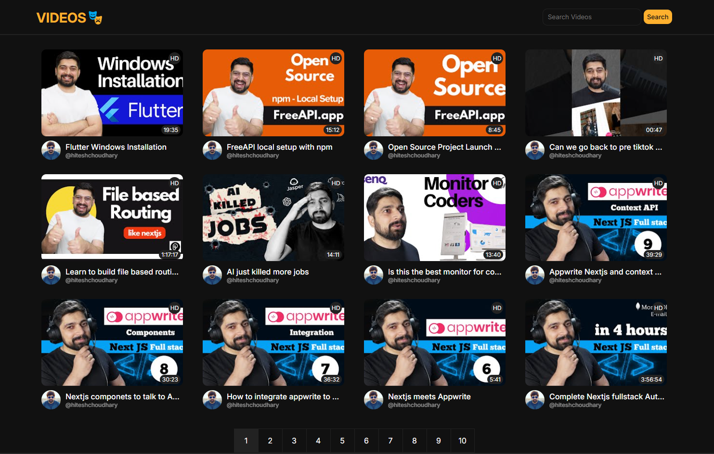

# Videos 🎭

A simple web application that fetches and displays YouTube videos using an API. Users can search for videos, navigate through pages, and watch videos directly on YouTube.

## Features

- Fetch and display YouTube videos dynamically
- Search functionality for quick video filtering
- Pagination to browse multiple pages of videos
- Video thumbnails, duration, and quality indicators
- Click on any video to watch it on YouTube
- Local storage caching for optimized performance

## Screenshot

## Deployment

You can access the live application [here](https://chuchrahimanshu.github.io/videos.github.io/).

## Technologies Used

- **HTML** - Structure of the application
- **CSS** - Styling for better UI/UX
- **JavaScript** - Fetching and rendering YouTube videos dynamically
- **API Source** - Fetching YouTube videos from [FreeAPI](https://api.freeapi.app/api/v1/public/youtube/videos)
